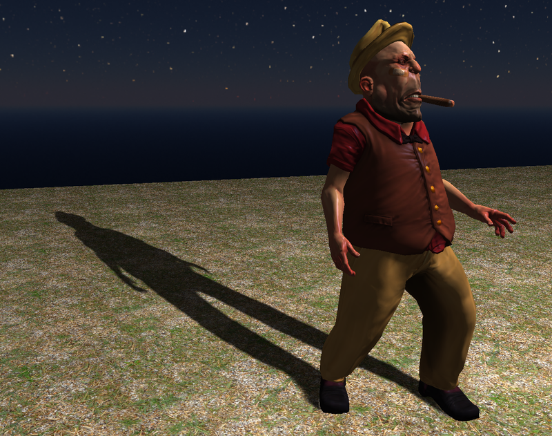

# Galt engine

In-progress OpenGL-based game engine. The goal of this engine is to be fully cross-platform, and allow for fast iteration time with hot-reloading code & assets, serialisable classes (no virtual functions or in-game heap allocations), and fast build times (no use of libraries like C++ STL).

### Building
`src/build.bat` *should* build out-of-the-box for Windows without issues (all dependencies are included in the repo), so long as Visual Studio environment variables are enabled (e.g. through Developer PowerShell for VS). Running `shell.bat` initialises build environment for default install location of Visual Studio 2022, if desired.

### Current features:
- Entity Component System
- Hot-reloading game code & shaders
- Fully featured skeletal / blend tree animation system
- Phong shading with normal map support
- Shadow maps

### Libraries used
- GLFW for creating window and initialising OpenGL context
- Glad for modern OpenGL function bindings
- GLM for OpenGL-friendly maths
- stb_image for texture loading
- Assimp for loading FBX model & animation files

### Asset credits
- "The Boss" model and animation clips from Mixamo